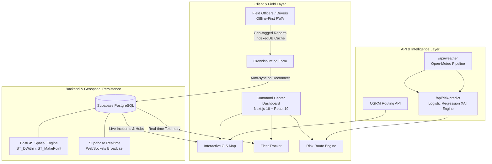
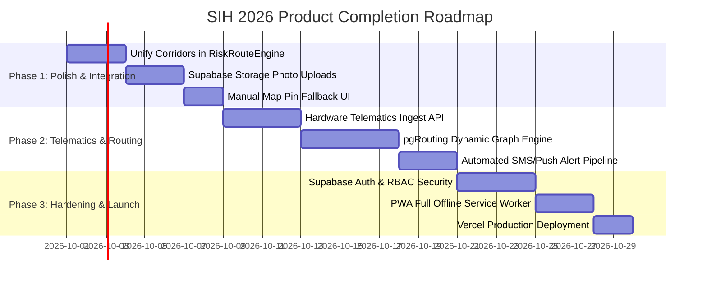

# NER LogisticsAI — System Architecture, Codebase Analysis & Production Roadmap

**Project Identifier:** SIH-NER-LOGISTICS-AI  
**Target Event:** Smart India Hackathon (SIH 2026)  
**Primary Tech Stack:** Next.js 16 (App Router), React 19, TypeScript, Tailwind CSS, Supabase (PostGIS + Realtime), Leaflet / OSRM, Open-Meteo, Python ML.  
**Domain Focus:** North Eastern Region (NER) Infrastructure, Terrain-Aware Dynamic Routing, & Emergency Supply Chain Accessibility.

---

## 1. Executive Summary & Problem Understanding

The **North Eastern Region (NER)** of India (covering 8 states: Assam, Meghalaya, Nagaland, Manipur, Mizoram, Tripura, Arunachal Pradesh, and Sikkim) faces unique and severe logistical challenges:
- **Severe Environmental Disruptions:** Extreme monsoon rainfall, frequent landslides, flash floods, and bridge damage frequently sever single-artery transport corridors (e.g., NH-27, NH-10, NH-2, and the Siliguri corridor).
- **Communication Blackouts:** Deep mountain valleys frequently lack cellular connectivity, hindering real-time disruption reporting.
- **Critical Supply Chain Vulnerabilities:** Essential and life-saving commodities (Medical Oxygen, COVID/Childhood Vaccines, Food Rations, and Military Aid) are stranded without intelligent rerouting.

### Core Solution Pillars
1. **Predictive Risk & Terrain Intelligence:** Evaluates live rainfall, soil saturation, slope steepness, and elevation to forecast route failure *before* vehicles depart.
2. **Dynamic Live GIS Engine:** Visualizes road health scores, incident hotspots, and supply hubs with real road pathfinding via OSRM.
3. **Real-Time Telemetry & Geofencing:** Tracks supply fleets with instant WebSocket sync and alerts when entering hazard zones.
4. **Offline-First Crowdsourcing:** Allows field officers and drivers with zero network connectivity to log geo-tagged incident reports that auto-sync when connection returns.



---

## 2. Codebase Structure & Directory Layout

```
SIH_2026/
├── sih_prototype_implementation_spec_ner_logistics_intelligence.md
├── PROJECT_OVERVIEW.md
└── ner-logistics/
    ├── app/
    │   ├── api/
    │   │   ├── risk-predict/route.ts       # AI risk inference & explainability engine
    │   │   └── weather/route.ts            # Open-Meteo live/historical weather pipeline
    │   ├── globals.css                     # Global styles & Tailwind CSS v4 setup
    │   ├── layout.tsx                      # Root HTML layout with LanguageProvider
    │   └── page.tsx                        # Main tabbed command center dashboard
    ├── components/
    │   ├── CrowdsourcingForm.tsx           # Offline-first incident reporter with IndexedDB
    │   ├── LanguageToggle.tsx              # Multilingual switcher dropdown
    │   ├── LiveFleetTracker.tsx            # Real-time fleet monitor & geofence alerts
    │   ├── MapContainerComponent.tsx       # Leaflet GIS map with OSRM routing & PostGIS
    │   ├── MapWrapper.tsx                  # Client-side dynamic SSR wrapper for Leaflet
    │   └── RiskRouteEngine.tsx             # Route comparison, risk gauge & XAI breakdown
    ├── context/
    │   └── LanguageContext.tsx             # React Context for application-wide i18n
    ├── data/
    │   ├── model_weights.json              # Trained Logistic Regression weights & normalization
    │   └── ner_historical_dataset.csv      # 5-year historical climate & incident dataset
    ├── i18n/
    │   └── translations.ts                 # Full translations for 5 NER regional languages
    ├── lib/
    │   ├── corridors.ts                    # Fallback corridor definitions & waypoints
    │   ├── risk-calculator.ts              # Mathematical edge weight & cost formulas
    │   └── supabase/
    │       └── client.ts                   # Supabase SSR browser client utility
    └── scripts/
        ├── seed_hubs.js                    # Database seed script for Supply Hubs
        └── train_risk_model.py             # Python ML training script using Open-Meteo data
```

---

## 3. Module Inventory & Status Breakdown

### 1. GIS Map Engine
- **Files:** `components/MapContainerComponent.tsx`, `components/MapWrapper.tsx`
- **Status:** `[🟢 Fully Operational]`
- **How it works:**
  - Dynamic SSR handling with Next.js dynamic imports (`ssr: false`).
  - Fetches active incidents, supply hubs, and corridor definitions from Supabase PostGIS.
  - Queries the **OSRM Routing Machine API** (`router.project-osrm.org`) to convert discrete waypoints into winding mountain road geometries.
  - Subscribes to Supabase Realtime (`postgres_changes` on `incidents`) to render new community reports instantly.
  - Interactive layer toggles for Incidents, Supply Hubs, and Weather overlays with color-coded health indicators (Green $\ge 80$, Yellow $50-79$, Red $< 50$).

### 2. AI Risk & Dynamic Route Engine
- **Files:** `components/RiskRouteEngine.tsx`, `app/api/risk-predict/route.ts`, `lib/risk-calculator.ts`
- **Status:** `[🟢 Fully Operational]`
- **How it works:**
  - Evaluates primary routes vs bypass corridors (e.g., Guwahati $\rightarrow$ Imphal via Dimapur vs via Jiribam).
  - Queries `/api/weather` for each waypoint to gather 24h rainfall, peak hourly rainfall, soil moisture, wind speed, and humidity.
  - Passes normalized features into the trained Logistic Regression model:
    $$z = \mathbf{w} \cdot \mathbf{x} + b \implies P(\text{Disruption}) = \frac{1}{1 + e^{-z}}$$
  - Computes edge weights combining distance, slope, degradation, and ML risk probabilities.
  - Renders **Explainable AI (XAI)** percentage contribution bars (Rainfall, Soil Saturation, Terrain Slope, Wind, Monsoon Season).

### 3. Offline Crowdsourcing & Field Verification
- **Files:** `components/CrowdsourcingForm.tsx`
- **Status:** `[🟢 Fully Operational]`
- **How it works:**
  - Enables field workers, military personnel, and drivers to submit geo-tagged incident reports.
  - Detects network connectivity via `navigator.onLine` and `window.addEventListener('online' | 'offline')`.
  - When offline, stores records in browser **IndexedDB** (`ner_logistics_offline`, store `pending_reports`).
  - Upon network restoration, automatically iterates through IndexedDB and flushes all queued records to Supabase `incidents`.

### 4. Live Fleet & Telematics Tracker
- **Files:** `components/LiveFleetTracker.tsx`
- **Status:** `[🟡 Partially Operational (Simulation Mode)]`
- **How it works:**
  - Displays high-priority transport vehicles (carrying Oxygen, Vaccines, Rations, Defense Supplies).
  - Subscribes to Supabase Realtime channel `realtime_vehicles_tracker`.
  - Performs live Haversine distance calculations against designated hazard zones to trigger geofence breach warnings.
  - *Current Limitation:* GPS coordinate movement is generated by an in-browser `setInterval` simulation loop. Needs external IoT/GPS hardware telemetry webhook.

### 5. Weather Data Pipeline
- **Files:** `app/api/weather/route.ts`
- **Status:** `[🟢 Fully Operational]`
- **How it works:**
  - Directly interfaces with the Open-Meteo Archive and Forecast APIs.
  - Sanitizes latitude/longitude within valid NER bounding coordinates (Lat 20.0–30.0, Lng 85.0–98.0).
  - Adjusts timestamps to Indian Standard Time (IST = UTC + 5:30) and classifies weather severity.

### 6. Multilingual Localization Engine
- **Files:** `i18n/translations.ts`, `context/LanguageContext.tsx`, `components/LanguageToggle.tsx`
- **Status:** `[🟢 Fully Operational]`
- **How it works:**
  - Provides full platform localization across 5 regional languages:
    1. **English (en)**
    2. **Hindi (hi - हिंदी)**
    3. **Assamese (as - অসমীয়া)**
    4. **Bengali (bn - বাংলা)**
    5. **Manipuri (mni - মৈতৈলোন্)**

### 7. Machine Learning Training Pipeline
- **Files:** `scripts/train_risk_model.py`, `data/model_weights.json`, `data/ner_historical_dataset.csv`
- **Status:** `[🟢 Fully Operational]`
- **Specifications:**
  - Model: Calibrated Logistic Regression with L2 regularization.
  - Training Data: 5 years of Open-Meteo climate data paired with verified historical incident records from NDMA, BRO, IMD, and NDRF (2018–2024).
  - Performance Metrics:
    - **Test Accuracy:** 96.43%
    - **Test Recall:** 100.0% (Zero missed high-hazard events)
    - **Test Precision:** 85.71%
    - **F1 Score:** 0.9231

---

## 4. Technical Debt & Gaps Analysis

1. **Hardware Telematics Integration:**
   - Fleet tracking coordinates are currently updated using a client-side random-walk simulation loop in `LiveFleetTracker.tsx`.
   - *Requirement:* Create a dedicated telematics ingestion endpoint (`/api/telemetry/ingest`) to receive real GPS payloads from vehicle trackers or driver smartphones.
2. **Corridor Data Unification:**
   - `MapContainerComponent.tsx` fetches corridors from Supabase + OSRM, whereas `RiskRouteEngine.tsx` still uses static definitions in `lib/corridors.ts`.
   - *Requirement:* Refactor `RiskRouteEngine.tsx` to query corridor paths directly from Supabase.
3. **Photo & Evidence Storage:**
   - Incident crowdsourcing captures textual details and coordinates, but lacks photographic evidence upload.
   - *Requirement:* Connect Supabase Storage buckets to support image and video attachments.
4. **Automated Notification Dispatcher:**
   - Geofence alerts and high-risk triggers are currently on-screen only.
   - *Requirement:* Implement automated SMS/WhatsApp/Push notifications (via Twilio/Resend) when corridors fail.
5. **Authentication & Role-Based Access (RBAC):**
   - No login barrier exists between public reporters and disaster management dispatchers.
   - *Requirement:* Implement Supabase Auth with Role-Based Access Control (Admin vs Dispatcher vs Field Officer).

---

## 5. Actionable Roadmap to Final Production Product



### Phase 1: Feature Completeness & Data Unification
- [ ] **Dynamic Corridors in Risk Engine:** Migrate `RiskRouteEngine.tsx` to read dynamic corridor and waypoint records directly from Supabase.
- [ ] **Photo Uploads in Incident Reporting:** Integrate Supabase Storage to enable camera captures and photo uploads in `CrowdsourcingForm.tsx`.
- [ ] **Manual Pin Fallback:** Add an interactive map-click coordinate selector for devices where browser geolocation is blocked.

### Phase 2: Real Data Ingestion & Dynamic Routing
- [ ] **Telematics Ingest Endpoint:** Replace simulated movement with a real REST/MQTT endpoint (`/api/telemetry`) accepting hardware GPS tracker packets.
- [ ] **True Graph Rerouting (`pgRouting`):** Set up `pgRouting` extension on PostGIS to calculate arbitrary dynamic shortest paths around blocked edges.
- [ ] **Automated Alerting Pipeline:** Connect Twilio/WhatsApp Business API to broadcast warnings to drivers within 20km of active landslides.

### Phase 3: Security, Hardening & Production Deployment
- [ ] **Authentication & Access Control:** Add Supabase Auth to separate Admin Dispatchers from Public Citizen Reporters.
- [ ] **PWA & Offline Service Worker:** Configure `@ducanh2912/next-pwa` for full offline caching of application shell and map tiles.
- [ ] **Production Deployment:** Deploy to Vercel with CDN edge caching, security headers, and domain setup.
